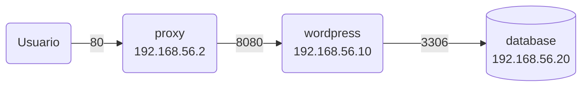
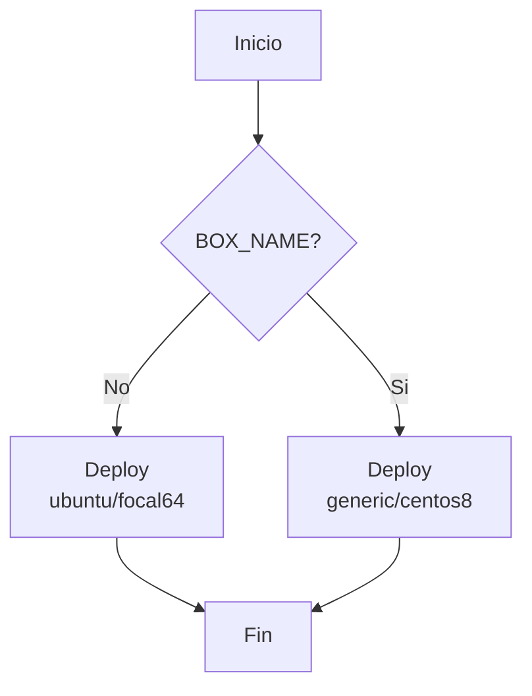

# Despliegue de Wordpress usando Vagrant y Chef

- Master 

Este proyecto es para una tarea de la Maestría en Desarrollo y Operaciones de UNIR.

El Objetivo es desplegar Wondpress usando Vagrant y Chef.

## Supuestos

- Se espera que la red de las VMs sea 192.168.56.0/24. Si VirtualBox tiene otro rango de red entonces hay que ajustar el archivio `.env` con los valores adecuados.

## Pre-requisitos

- Necesitas tener instalado Git
- Necesitas tener instalado Vagrant 2.3.7 o superior
- Necesitas tener instalado VirtualBox 7.0 o superior

Instala el plugin `vagrant-env` para poder cargar variables ed ambiente desde el archivo `.env`

```bash
 vagrant plugin install vagrant-env
```

## Arquitectura



## Configuraciones

En el archivo `.env` se pueden definir algunos valores como las IPs de las máquinas virtuales y el usuario y el password de la BD que se usará para configurar Wordpress.

Antes de levantar Vagrant se puede definir la caja que se usará. Mira el siguiente diagrama:



Lee la sección [Uso](#uso) para ver ejemplos de esto.

## Uso

Para levantar las dos máquinas virtuales con Ubuntu 20.04 ejecuta el comando:

```bash
 vagrant up
```

Para levantar las dos máquinas virtuales con CentOS 8 ejecuta el comando:

```bash
 BOX_NAME="generic/centos8" vagrant up
```

Se van a crear dos máquinas virtuales, una llamada `wordpress` y otra llamada `database`.
Si quieres mezclar las versiones puedes hacerlo del siguiente modo.

### Wordpress con Ubuntu y MySQL con CentOS:

```bash
 vagrant up wordpress
 BOX_NAME="generic/centos8" vagrant up database
```

### Wordpress con CentOS y MySQL con Ubuntu:

```bash
 BOX_NAME="generic/centos8" vagrant up wordpress
 vagrant up database
```

## Wordpress

Una vez que se hayan levantado todas las VMs podrás acceder a Wordpress en la página: http://192.168.56.2/


## Unit tests

### Ejecutando las pruebas con Docker

Para probar con Docker hay que usar la imagen `cppmx/chefdk` y montar la carpeta con las pruebas.

Si queremos probar las recetas de la base de datos usaremos el siguiente comando:
```bash
 docker run --rm -v $(pwd)/tests/test_database:/cookbooks cppmx/chefdk:latest chef exec rspec --format=documentation
```

Si queremos probar las recetas de wordpress usaremos el siguiente comando:
```bash
 docker run --rm -v $(pwd)/tests/test_wordpress:/cookbooks cppmx/chefdk:latest chef exec rspec --format=documentation
```

Si queremos probar las recetas del proxy usaremos el siguiente comando:
```bash
 docker run --rm -v $(pwd)/tests/test_proxy:/cookbooks cppmx/chefdk:latest chef exec rspec --format=documentation
```
### Ejecutando las pruebas con Vagrant

Cambiate al directorio `tests` y ejecuta el script `unit_tests.sh`.

```bash
 cd tests
 ./unit_tests.sh
```
